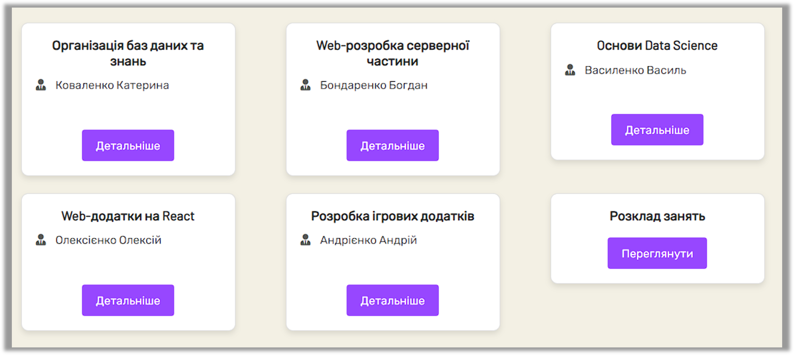
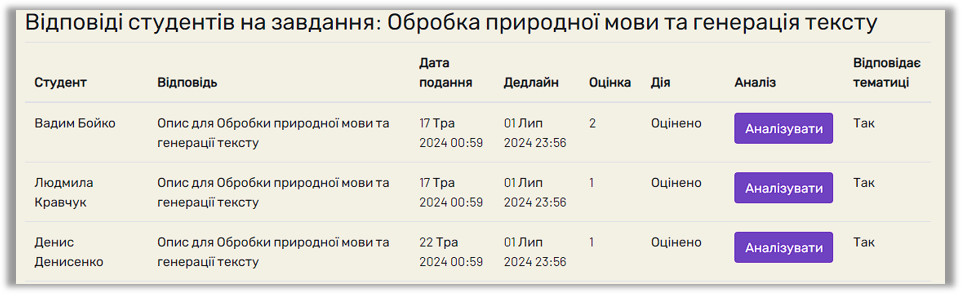

# Student Portal

A web application designed to manage and simplify student-related activities and data for educational institutions.

## Table of Contents

- [About the Project](#about-the-project)
- [Features](#features)
- [Installation](#installation)
- [License](#license)
- [Contact](#contact)
- [Contributing](#contributing)

## About the Project

A Django-based web-based solution designed to enhance the online education experience using **machine learning** and **artificial intelligence**. This platform focuses on **personalised learning paths**, **adaptive material customisation**, and **automated assessment** of student responses. The platform is user-friendly and equipped with tools to improve efficiency in managing academic information and communication within educational institutions.


## Features

- User authentication and role-based access (Admin, Teacher, Student).
- Dashboard for easy navigation and data visualisation.
- Manage student records including grades, attendance, and schedules.
- AI-driven algorithms personalise learning materials and assessments based on individual student performance.
- Semantic analysis ensures that student responses align with assigned topics.
- Tools summarise and evaluate student answers.
- Text similarity checks validate response relevance.
- Includes tools such as note-taking, integrated dictionaries, unit converters, and resource searches (e.g., YouTube, Wikipedia).
- Visualisation of student performance and progress through interactive dashboards.


**User Roles**:
   - **Students**: Access personalised learning paths, view schedules, complete assignments, and receive automated feedback.
   - **Teachers**: Create and manage assignments, track student performance, and utilise AI-powered insights.
   - **Administrators**: Oversee the platform's operation and manage roles and permissions.


## Purpose

This platform enables institutions to modernise their learning processes, offering a user-friendly and intelligent system that adapts to the unique needs of every student while simplifying administrative and teaching workflows.

---

Feel free to contribute, report issues, or explore the codebase to understand how this platform transforms traditional education into a data-driven, AI-powered experience.


## Installation

**Clone the repository:**
   ```bash
   git clone https://github.com/Astory-Vika/Student_Portal.git\
```

## Setup

**Install the required dependencies**:
   ```bash
   pip install -r requirements.txt
```

## Installation and Setup

To set up and run the project locally, follow these steps:

**Run database migrations**:
   ```bash
   python manage.py migrate
   ```
## Start the Development Server

**Start the development server**:
   ```bash
   python manage.py runserver
   ```
## License

This project is licensed under the [MIT License](LICENSE).  
You are free to use, modify, and distribute this project in accordance with the terms of the license.

## Contact

For any inquiries or feedback, feel free to reach out:

- **Author**: Viktoriia Astafieva  
- **GitHub**: [Astory-Vika](https://github.com/Astory-Vika)  
- **Email**: [viktoriia@astafievaai.com](mailto:viktoriia@astafievaai.com)

## Contributing

Contributions are welcome! To contribute to this project, follow these steps:

1. Fork the repository.
2. Create a branch for your feature:
   ```bash
   git checkout -b feature-name
